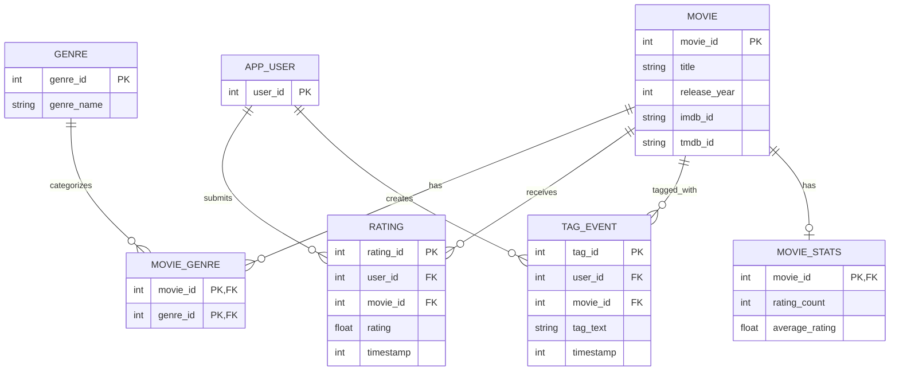

# CineSearch – Entity Relationship Diagram

This diagram represents the relational database structure used in CineSearch.

```mermaid
erDiagram
    MOVIE ||--o{ MOVIE_GENRE : has
    GENRE ||--o{ MOVIE_GENRE : categorizes

    APP_USER ||--o{ RATING : submits
    MOVIE ||--o{ RATING : receives

    APP_USER ||--o{ TAG_EVENT : creates
    MOVIE ||--o{ TAG_EVENT : tagged_with

    MOVIE ||--o| MOVIE_STATS : has

    MOVIE {
        int movie_id PK
        string title
        int release_year
        string imdb_id
        string tmdb_id
    }

    GENRE {
        int genre_id PK
        string genre_name
    }

    MOVIE_GENRE {
        int movie_id PK, FK
        int genre_id PK, FK
    }

    APP_USER {
        int user_id PK
    }

    RATING {
        int rating_id PK
        int user_id FK
        int movie_id FK
        float rating
        int timestamp
    }

    TAG_EVENT {
        int tag_id PK
        int user_id FK
        int movie_id FK
        string tag_text
        int timestamp
    }

    MOVIE_STATS {
        int movie_id PK, FK
        int rating_count
        float average_rating
    }
```
